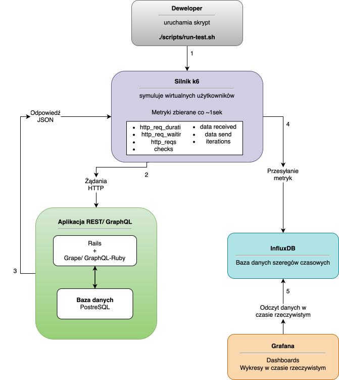
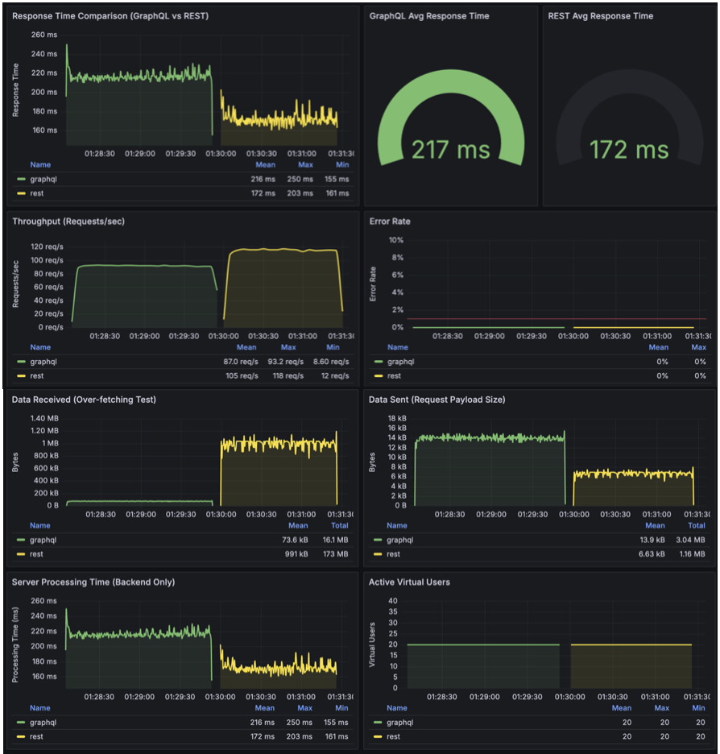

# GraphQL vs REST Benchmark

A comprehensive performance comparison between GraphQL and REST API architectures for a master's thesis project.

## Project Overview

This repository contains a complete benchmarking environment to systematically compare GraphQL and REST implementations of the same event management and ticketing application in typical user usage scenarios.

### Applications Under Test

- **EventQL** - GraphQL API (Rails 8 + graphql-ruby)
- **EventREST** - REST API (Rails 8 + Grape)

Both applications implement identical business logic:
- Event management and browsing
- Ticket batch management with time-based availability
- Order creation and payment processing
- User authentication and authorization (JWT)

## Testing Methodology

### Test Scenarios

The comparison is conducted across 5 scenarios representing typical application usage patterns:

| Scenario | Verification Goal | Execution Description |
|----------|-------------------|----------------------|
| **Simple Read** | Basic performance for single resource | Fetching user by ID |
| **Nested Data** | N+1 problem and request count for nested relations | Fetching events with ticket batches |
| **Selective Fields** | Over/under-fetching verification | Fetching events with selected fields only |
| **Write Operations** | Write operation performance | Creating a new order |
| **Concurrent Users** | Real production load simulation | Full path: search → details → login → purchase → verification |

## Test Environment Architecture

The entire test environment is containerized and managed by Docker Compose, orchestrating application containers and measurement tools.

### Tools Used

- **k6** - Load testing engine and user traffic generator
- **InfluxDB** - Time-series database for collecting real-time performance metrics
- **Grafana** - Results visualization and analytical dashboards

### Container Parameters

| Service | CPU | RAM | Description |
|---------|-----|-----|-------------|
| EventQL (GraphQL) | 2 cores | 4 GB | GraphQL API application |
| EventREST (REST) | 2 cores | 4 GB | REST API application |
| PostgreSQL | 2 cores | 1 GB | Database server |
| Redis | 0.5 cores | 512 MB | Cache layer |
| InfluxDB | 1 core | 1 GB | Metrics storage |
| Grafana | 0.5 cores | 512 MB | Visualization |

Application parameters (2 CPU, 4 GB RAM) correspond to a mid-tier DigitalOcean droplet at $24/month.

### Architecture Diagram

### Grafana Monitoring Dashboard

## Research Results

### Scenario 1: Simple Read

REST showed a clear advantage, executing the test almost twice as fast with significantly higher throughput, lower data transfer, and more stable response times.

### Scenario 2: Nested Data

GraphQL showed a clear advantage, executing the test 36% faster with higher throughput and approximately 80% reduction in data transfer, eliminating the N+1 problem characteristic of REST.

### Scenario 3: Selective Fields

REST showed better time performance, executing the test 25% faster. However, GraphQL reduced data transfer by over 90%, eliminating the over-fetching problem characteristic of REST.

### Scenario 4: Write Operations

REST showed slightly better performance in write operations. However, the differences mainly result from simpler architecture rather than the actual data writing process in the database.

### Scenario 5: Concurrent Users

REST showed better time performance, executing the test 41% faster with more stable response times. However, GraphQL significantly reduced data transfer, which is crucial in bandwidth-constrained environments.

## Author

Jakub Mikołajczyk

## License

This project is part of a master's thesis.
